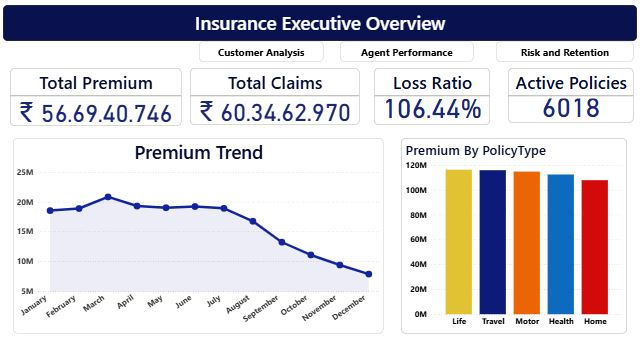
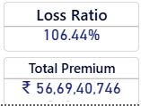
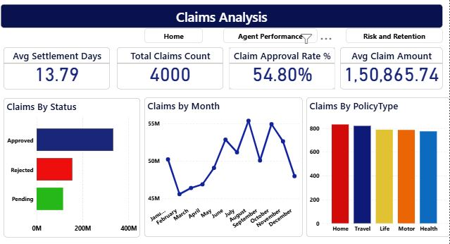
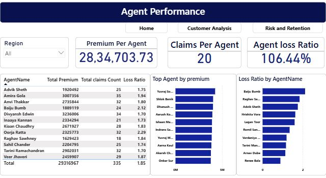
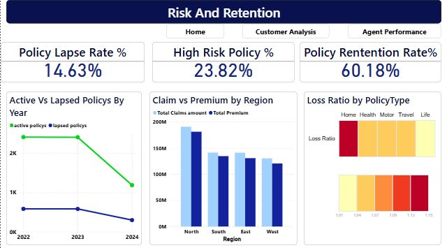

# Insurance-Business-Analytics-Dashboard
Designed a Power BI Banking dashboard delivering insights on loans, deposits and customer behaviour to support strategic decision making.

##**OVERVIEW**

This project presents a comprehensive, interactive Business Intelligence dashboard designed to monitor and analyze critical KPIs within an insurance firm. The primary objective is to provide executive stakeholders with actionable insights into revenue generation (premiums), operational efficiency (claims processing), sales effectiveness (agent performance), and portfolio health (risk and retention).
By tracking a staggering **106.44%** Loss Ratio, this analysis serves as a critical diagnostic tool to identify areas of revenue leakage, optimize underwriting strategies, and improve overall profitability.

##**PROJECT OBJECTIVES**

**Monitor Profitability:** Track the Loss Ratio to identify revenue leakage and unprofitable policy types.

**Analyze Claims Efficiency:** Evaluate settlement times and approval rates to optimize operational workflows.

**Evaluate Agent Performance:** Measure sales quality by comparing individual premiums generated against claim risk.

**Identify Retention Risk:** Detect trends in policy lapses and high-risk segments to reduce customer churn.

**Optimize Product Strategy**: Compare performance across regions and policy types to guide pricing and underwriting.

##**DATA MODEL**

**Fact Tables:** Claims, Premiums, Policies
**Dimension Tables:** Customers, Agents, Policy, Regions
**Schema:** Star Schema

##**KEY BUSINESS INSIGHTS**

As a data analyst, I extracted the following critical insights from the dashboard:

**Profitability Alert:** The current overall Loss Ratio sits at **106.44%**(Total Claims: **₹60.34Cr** vs. Total Premium: **₹56.69Cr**). This indicates that the company is currently paying out more in claims than it is earning in premiums, signaling an urgent need to review underwriting and pricing models.

**Declining Revenue Trend:** Premium collections show a steady, alarming decline from March through December.

**Claims Bottlenecks:** While the average settlement time is reasonable (**13.79 days**), the Claim Approval Rate is heavily constrained at**54.80%**, which may lead to customer dissatisfaction and increased policy lapses.

**Retention Crisis:** There is a sharp decline in active policies heading into **2024**, coupled with a high Policy Lapse Rate of **14.63%** and nearly a quarter of the portfolio (**23.82%**) flagged as "High Risk."

**Regional Discrepancies:** The North region generates the highest premium but also incurs the highest total claim amounts, indicating a high-volume, high-risk market.

##**Potential Next Steps for the Business**

**Underwriting Review:** Immediately investigate the pricing models for policy types showing loss ratios above 100%.

**Agent Training:** Implement targeted coaching for agents writing policies with disproportionately high loss ratios.

**Customer Success:** Investigate the massive drop in active policies in **2024** and streamline the claims process to improve the **54%** approval rate, reducing customer churn.

##**TECH STACK & METHODOLOGIES**

**Tools**: Power BI, Excel

**Data Processing:** Power Query, Data Modeling (Star Schema)

**Calculations:** DAX (Data Analysis Expressions) for custom KPIs

**Techniques**: Time-Intelligence functions, dynamic tooltips, interactive filtering (cross-highlighting), and custom visual formatting.

##**DASHBOARD PREVIEW**

##**LIVE REPORT LINK**

[view like report](https://app.powerbi.com/view?r=eyJrIjoiYzQ1ZjZjNGEtMWRhYi00YmY2LTliOGItNjcyOTI3MTIwNzIwIiwidCI6ImZlZDkxNzcyLWMyZDItNGNlYS05ZmY5LWMwZmY3ZDdkMGU1NyJ9)
